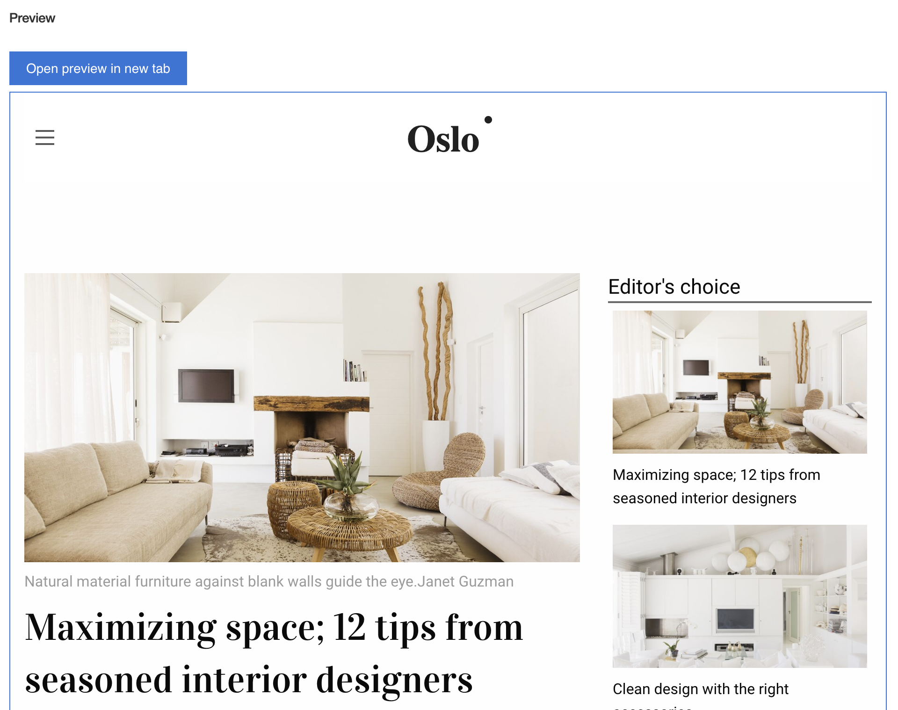
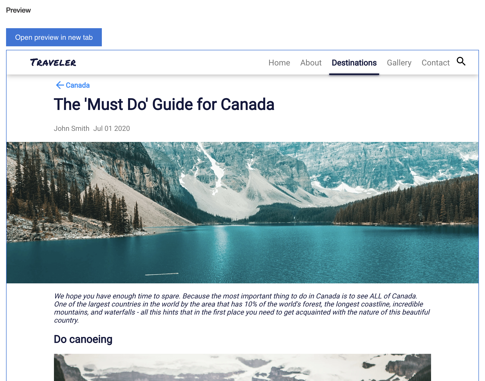

# Content Preview UI Extension Sample

This sample extends the Authoring interface of Acoustic Content by adding a 'Content Preview' feature. This custom UI extension renders any content item right in the authoring user interface. It gives content authors a preview of how a content item will appear after it's published on a website.

This scenario assumes that either:

(1) You're using the Acoustic Content as a 'hybrid' CMS with Standard tier's 'Websites' feature but you are building some of the content in the 'Content' are of the user interface. In this case, Acoustic Content makes a preview of these items available such that editors could preview created entries before they go live.

Or:

(2) You're using Acoustic Content as a 'headless' CMS (Essentials tier) and you have an online version of your website or an app, built by the development team so that editors could preview created entries before they go live. 

## Using the Sample in a 'Hybrid' setup

Here's what the sample looks like when used in scenario (1) with the [Oslo website](https://github.com/acoustic-content-samples/wch-site-application):


[Watch demo video here](https://youtu.be/atT_uEV6jZI)

In this case, the exact config (as specified later in *Deploy the sample into Acoustic Content*) is:

```json
{ "url": "/design-topics/{slugify(content.name)}" }
```

## Using the Sample in a 'Headless' setup

Here's what the sample looks like when used in scenario (2) with the [Traveller website](https://github.com/acoustic-content-samples/sample-react-traveler-website):



In this case, if you want to provide a preview for one of the Travel Articles in `Canada` category, the config looks like this: 

```json
{ "url": "/samples/traveler-website/index.html#/destination/North%20America/Canada/{content.id}" }
```

## Installing the Sample

### Prerequisites

- [wchtools-cli](https://github.com/acoustic-content-samples/wchtools-cli) v2.3.4 or above;

- Run `wchtools init` to setup the [WCH tools CLI](https://github.com/acoustic-content-samples/wchtools-cli#getting-started);

- Download or clone this repository to get the 'Content Preview' artifacts.

### Deploy the sample into Acoustic Content

1. Install dependencies by running `npm install`;

2. Run `npm run hub-build-deploy` command to deploy the UI extension sample to the Content Hub;

3. Add the 'Content Preview' UI extension to the Content Type of your choice. Make sure that 'Provide a custom user interface extension' checkbox is on, otherwise you won't be able to access this section.

The UI extension needs to know where the pages are located for a given content item. A single `url` parameter is reuqired for configuration, which can be specified in 'Specify configuration for the custom user interface' text area. This URL should be to your preview environment. 

For example, if the articles with ID 1234-5678 appears in the website under /articles/1234-5678 then the config should be defined like this:

   ```json
   { "url": "preview.example.com/articles/{content.id}" }
   ```

Any property of the `content` object can be accessed using this notation, including nested properties.

   ```json
   { "url": "preview.example.com/articles/{content.elements.slug.value}" }
   ```
The UI extension also provides a 'slugify' method that can be used to return a version of the content name that has spaces replaced with dashes and so forth. Use it for example like this:

   ```json
   { "url": "preview.example.com/articles/{slugify(content.name)}" }
   ```

If your site is hosted on Acoustic Content, the you can omit the domain, and the Acoustic Content preview environment will be assumed, like this:

   ```json
   { "url": "/articles/{slugify(content.name)}" }
   ```

### Debugging and testing

While making changes to the sample you can publish changes with `npm run hub-build-deploy` command.

If you want to develop another sample (with the use of this one) that requires more code/deploy/test cycles we recommend to do it locally:

- [Setup extension locally](https://github.com/acoustic-content-samples/sample-custom-element-ui#running-testing-and-debugging-custom-user-interface-extensions-locally)

- Inside `package.json` set `homepage` value with directory path wihout content hub id

  ```
    "homepage": "/dxauth/ui-extension-content-preview",
  ```

- Use `npm run hub-build` to update the sample with changes
